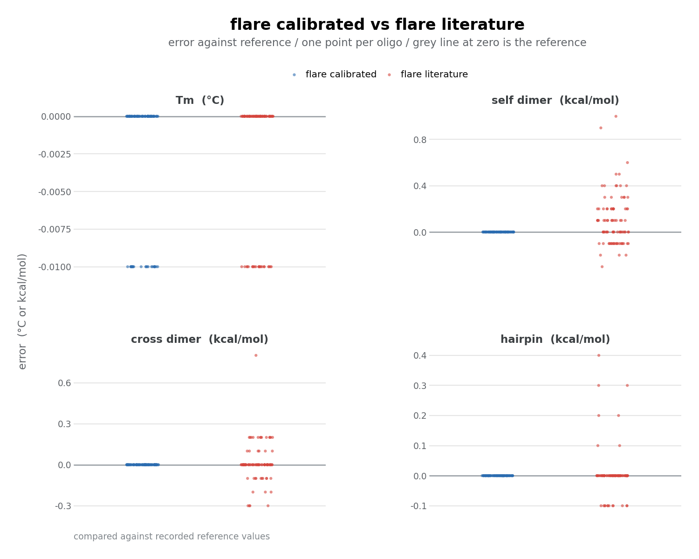

# Flare

Flare is an independent oligo thermodynamics engine for TaqMan assays, built on published nearest-neighbor science.

Parameters come from published science. The optional `calibrated` mode tunes a handful of parameters against observed reference values, with no access to any third-party source code or binaries. See `NOTICE.md`.

## Use

Run Flare on an assay:

    uv run python -m flare SENSE ANTISENSE PROBE

Save the comparison figure as PNG:

    uv run python -m flare.plots

Run the frozen tests:

    uv run python -m pytest tests/ -q

## Example

    uv run python -m flare TCTAACTAGCACACTAACTAATGTCA AACACTTGTGCGGTAACCTC CAGAATGTGTTAACCTGTCTTCT

    oligo      len      Tm    GC% clamp   self  hairpin
    sense       26   56.96  34.62     1   -1.6     -1.0
    antisense   20   56.44  50.00     2   -1.5      0.0
    probe       23   55.22  39.13     1   -4.3     -1.8

    cross sense antisense -5.1
    cross sense probe -2.7
    cross antisense probe -3.9

Tm is in °C; self-dimer, cross-dimer and hairpin are ΔG in kcal/mol (0.0 means none found below threshold).