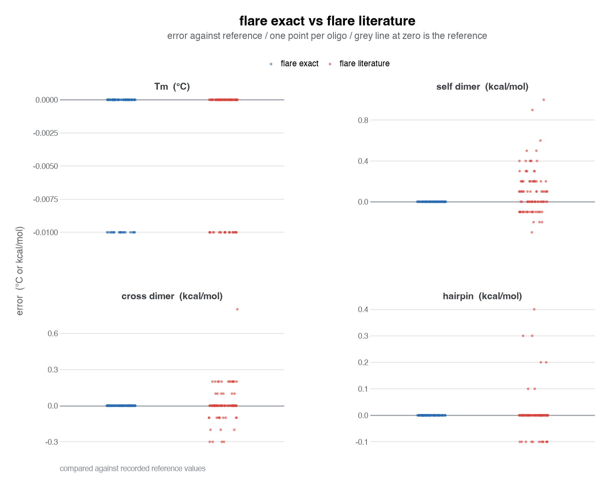

# Flare

Flare is an independent oligo thermodynamics engine for TaqMan assays, built on published nearest-neighbor science and benchmarked against Beacon Designer.

Parameters come from published science. The `beacon_exact` fit uses outputs observed from Beacon Designer Free Edition only, with no access to PremierBiosoft source code.

## Use

Run Flare on an assay:

    uv run python -m flare SENSE ANTISENSE PROBE

Save the comparison figure as PNG:

    uv run python -m flare.plots

Run the frozen tests:

    uv run python -m pytest tests/ -q
